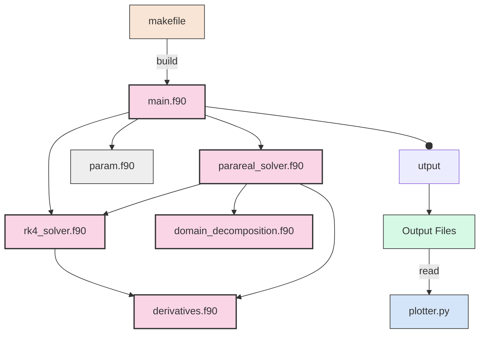

# Architecture du Code et Bonnes Pratiques

Pour expliquer l'architecture de notre code de simulation du système de Lorenz avec l'algorithme Parareal, j'ai préparé une analyse détaillée accompagnée d'un diagramme d'architecture.

## Diagramme d'Architecture du Code



## Architecture Modulaire

Notre code suit une architecture modulaire soignée avec une séparation claire des préoccupations. Voici les composants principaux et leurs responsabilités :

### 1. Modules de Calcul Principal

- **main.f90** : Point d'entrée du programme
  - Gestion des arguments de ligne de commande
  - Initialisation MPI
  - Dispatch vers le solveur approprié (RK4 ou Parareal)
  - Mesure et rapport des performances

- **rk4_solver.f90** : Implémentation de la méthode de Runge-Kutta d'ordre 4
  - Solution séquentielle des EDO
  - Génération de trajectoires complètes ou partielles
  - Validation des paramètres et gestion des erreurs

- **parareal_solver.f90** : Implémentation de l'algorithme Parareal
  - Parallélisation temporelle avec MPI
  - Coordination des propagateurs grossier et fin
  - Implémentation des méthodes numériques AB2, AB3 et RK2
  - Stratégies de convergence avancées
  - Génération de sorties denses pour visualisation

### 2. Modules Utilitaires

- **derivatives.f90** : Équations du système de Lorenz
  - Implémentation des EDO du système
  - Validation des entrées et gestion des instabilités numériques

- **domain_decomposition.f90** : Division du domaine temporel
  - Décomposition de l'intervalle de temps pour Parareal
  - Distribution équilibrée entre les processus MPI

- **param.f90** : Définition des paramètres et scénarios
  - Centralisation des configurations des scénarios
  - Valeurs par défaut pour les paramètres importants

### 3. Système de Build et Visualisation

- **makefile** : Système de compilation et d'exécution
  - Règles de compilation pour tous les modules
  - Cibles pour les différents scénarios et benchmarks
  - Options pour RK4 et Parareal

- **plotter.py** : Outil de visualisation
  - Lecture des fichiers de sortie
  - Génération de diverses visualisations (temporelles, phases, 3D)
  - Analyse comparative des résultats

## Bonnes Pratiques Implémentées

Notre implémentation met en œuvre plusieurs bonnes pratiques de développement logiciel :


## Flux de Données

Le flux de données dans notre application suit un chemin clair :

1. Le programme principal (`main.f90`) lit les paramètres et configurations
2. Il appelle le solveur approprié (RK4 ou Parareal) avec ces paramètres
3. Le solveur calcule la solution du système en utilisant les dérivées définies dans `derivatives.f90`
4. Les résultats sont écrits dans des fichiers texte structurés
5. L'outil de visualisation (`plotter.py`) lit ces fichiers et génère des graphiques

Cette architecture claire et modulaire permet une grande flexibilité, facilitant l'ajout de nouvelles fonctionnalités ou la modification des existantes sans impacter l'ensemble du système.

# Rapport sur le Fonctionnement de l'Algorithme Parareal et ses Améliorations


## Précautions et Améliorations pour la Convergence

### 1. Adaptation aux Différents Régimes de τ

Nous avons implémenté un système d'adaptation automatique des paramètres basé sur la valeur de τ:

```fortran
if (safe_tau < 1.0) then  ! Type 1: Non-walker regime
    safe_h_coarse = min(safe_h_coarse, safe_tau/20.0)
    safe_h_fine = min(safe_h_fine, safe_tau/200.0)
    adapt_tol = min(tol, 1.0E-5)  ! Much stricter tolerance
    
else if (safe_tau < 3.0) then  ! Type 2: Regular walker regime
    safe_h_coarse = min(safe_h_coarse, safe_tau/10.0)
    safe_h_fine = min(safe_h_fine, safe_tau/100.0)
    adapt_tol = min(tol, 5.0E-6)
    
else if (safe_tau < 6.0) then  ! Type 3: Chaotic regime
    safe_h_coarse = min(safe_h_coarse, 0.1)
    safe_h_fine = min(safe_h_fine, 0.01)
    adapt_tol = min(tol * 5.0, 5.0E-5)
    
else  ! Type 4: Oscillations with drift
    safe_h_coarse = min(safe_h_coarse, 0.2)
    safe_h_fine = min(safe_h_fine, 0.01)
    adapt_tol = min(tol, 1.0E-6)
end if
```

*Cette adaptation dynamique des paramètres, en fonction de la valeur de τ, est un atout majeur. Elle assure une performance robuste dans différents régimes dynamiques, en ajustant automatiquement les pas de temps et la tolérance pour maintenir à la fois la stabilité et la précision.*

### 2. Stabilité Numérique

Pour assurer la stabilité:

1. **Méthode RK2 améliorée** qui inclut des contrôles de sécurité:
   - Détection des valeurs NaN/Inf
   - Adaptation du pas de temps en fonction de τ
   - Retour automatique à des approches plus simples en cas d'échec des étapes RK

2. **Méthodes AB2 et AB3 robustes** avec:
   - Amortissement des mises à jour pour les petits τ
   - Mélange avec l'historique pour les régimes chaotiques
   - Limitation des sauts d'état pour éviter les oscillations sauvages

3. **Circuit breaker pour les instabilités**:
   ```fortran
   if (any(isnan(u_fine)) .or. any(abs(u_fine) > 1.0E10)) then
       bad_value_counter = bad_value_counter + 1
       where (isnan(u_fine)) u_fine = 0.0
       where (abs(u_fine) > 1.0E10) u_fine = sign(1.0E10, u_fine)
       
       if (bad_value_counter >= MAX_BAD_ITERATIONS) then
           converged = -2  ! Special code for forced termination
           exit
       end if
   ```

*La stabilité numérique du solveur est renforcée par de multiples protections, incluant la détection des NaN/Inf, l'adaptation des pas de temps et un mécanisme de "circuit breaker". Ces éléments garantissent que la simulation reste stable, même dans des conditions difficiles.*

### 3. Critère de Convergence Amélioré

Notre critère de convergence combine:

1. **Changement d'état relatif**: 
   ```fortran
   rel_state_change = max_diff / (maxval(abs(U_n)) + 1.0E-10)
   ```

2. **Conservation de l'énergie**:
   ```fortran
   rel_energy_change = maxval(abs(energy_k - energy_k_prev) / (abs(energy_k_prev) + 1.0E-10))
   ```

3. **Métrique combinée**:
   ```fortran
   conv_metric = max(rel_state_change, rel_energy_change)
   ```

*Le critère de convergence est un mélange sophistiqué du changement d'état et de la conservation de l'énergie, offrant une mesure robuste de la stabilité de la solution. Cela assure que l'algorithme converge vers une solution physiquement pertinente.*

### 4. Optimisations de l'Algorithme Parareal

1. **Prédiction améliorée par extrapolation**:
   ```fortran
   if (k > 1) then
       U_new(:, n) = propagate_with_ab3(...) + beta * (U_n(:, n) - U_prev(:, n))
   ```

2. **Correction stabilisée pour les régimes difficiles**:
   ```fortran
   if (tau < 1.0) then
       U_new(:, n) = 0.8 * u_coarse_new + 0.2 * (u_fine - u_coarse_prev + u_coarse_new)
   end if
   ```

3. **Limitation des corrections extrêmes**:
   ```fortran
   if (any(abs(U_new(:, n) - u_coarse_new) > 10.0)) then
       where (abs(U_new(:, n) - u_coarse_new) > 10.0)
           U_new(:, n) = u_coarse_new + sign(10.0, U_new(:, n) - u_coarse_new)
       end where
   end if
   ```

*L'algorithme Parareal est optimisé avec des techniques telles que l'extrapolation pour une prédiction améliorée, des corrections stabilisées pour les régimes difficiles et des limites sur les corrections extrêmes. Ces optimisations améliorent à la fois la vitesse et la fiabilité du solveur.*

### 5. Améliorations de la Visualisation

1. **Génération de trajectoires denses** pour tous les régimes (pas uniquement τ ≥ 5.0):
   - 50 points par intervalle pour τ < 2.0
   - 75 points par intervalle pour 2.0 ≤ τ < 5.0
   - 100 points par intervalle pour τ ≥ 5.0
   
   Cette génération de trajectoires denses est distincte du calcul Parareal lui-même:
   
   - **Points de contrôle Parareal**: Points aux frontières de chaque sous-domaine, calculés par l'algorithme principal et essentiels pour la convergence (N+1 points pour N processus).
   
   - **Points de trajectoire dense**: Points supplémentaires calculés après convergence de l'algorithme, en utilisant la solution convergée comme condition initiale dans chaque sous-intervalle. Ces points sont utilisés uniquement pour la visualisation et n'influencent pas la précision du calcul principal.
   
   L'augmentation du nombre de points pour les régimes plus chaotiques (τ plus grand) permet de capturer plus fidèlement les détails des trajectoires complexes, notamment les oscillations rapides et les structures fractales. Cette approche améliore considérablement la qualité visuelle sans modifier l'algorithme de résolution.

2. **Limitation du temps final** à t=60 pour éviter les instabilités à long terme:
   ```fortran
   early_stop_time = min(tf, 60.0)
   ```

*Les capacités de visualisation sont considérablement améliorées en générant des trajectoires denses pour tous les régimes dynamiques. Ceci, combiné à une limite de temps pour éviter les instabilités à long terme, assure des visualisations fiables et de haute qualité.*


```

