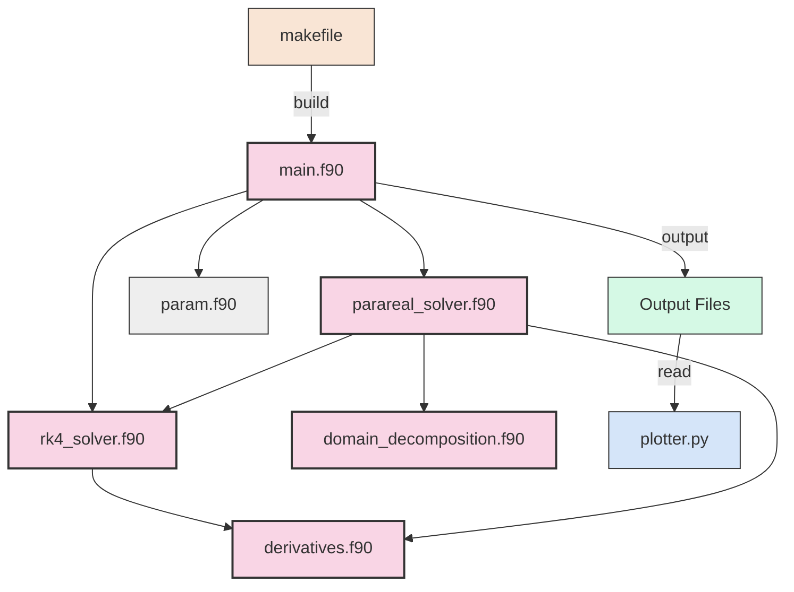

```mermaid
graph TD
    A[main.f90] --> B[rk4_solver.f90]
    A --> C[parareal_solver.f90]
    B --> D[derivatives.f90]
    C --> D
    C --> E[domain_decomposition.f90]
    C --> B
    A --> F[param.f90]
    G[makefile] --build--> A
    A -- output--> H[Output Files]
    H --read--> I[plotter.py]
    
    classDef core fill:#f9d5e5,stroke:#333,stroke-width:2px;
    classDef util fill:#eeeeee,stroke:#333,stroke-width:1px;
    classDef data fill:#d5f9e5,stroke:#333,stroke-width:1px;
    classDef viz fill:#d5e5f9,stroke:#333,stroke-width:1px;
    classDef build fill:#f9e5d5,stroke:#333,stroke-width:1px;
    
    class A,B,C,D,E core;
    class F util;
    class H data;
    class I viz;
    class G build;
```